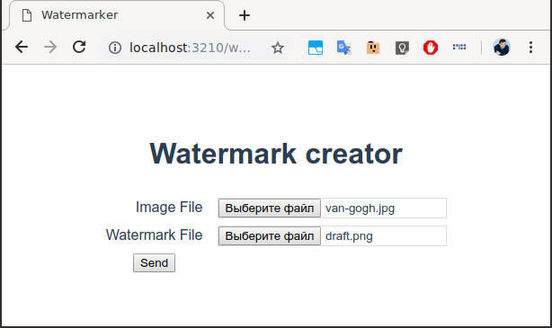
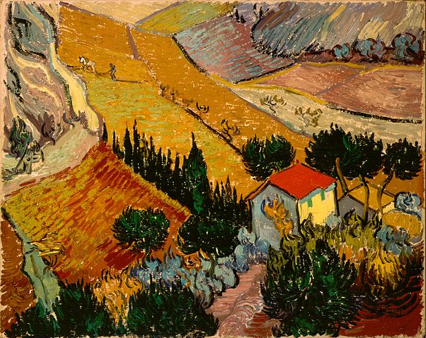
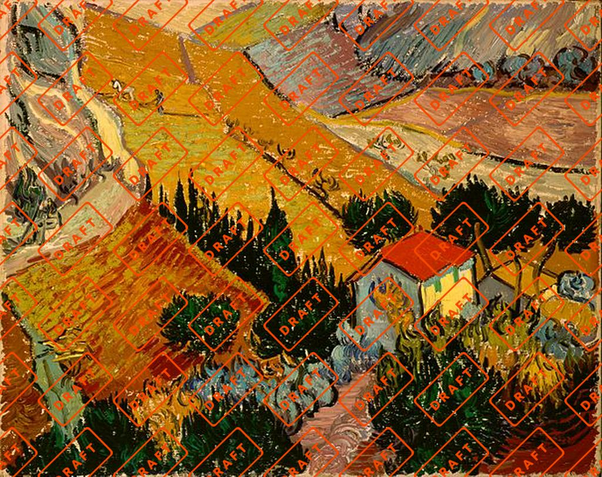

# hr-strmd-watermarker

Image watermark example app.



`Watermarker` is a simple `Vue` and `Go` application which helps you to overlay a watermark to your image.

A couple of rules:

- The base image will be resized to 1024px by longest size.
- Watermark alignes to center of base image and tile it.

## Example

- Source image:

    

- Watermark:

    

- Result:

    


## Used libraries

- `node v11.10.1`
- `npm 6.8.0`
  - `vue 2.6.6`
  - `axios 0.18.0`
  - `js-file-download 0.4.4`
- `go 1.12`
  - `nfnt/resize`
- `docker 18.09`


## Build

I strictly recommend you to use my multistage `Dockerfile` (you need working `docker`):

```shell
$ docker build -t watermarker
```

Docker load all dependencies, build both `Vue` and `Go` applications and creates scratch `watermarker` image, contains executables only.

## Usage

1. Run `watermarker` container, created in the previous step (do not forget to expose ports):
   ```shell
    $ docker run -p 3210:3210 watermarker
    ```
1. Open http://localhost:3210/watermark/ page in your browser.
1. Choose the base (JPEG) and the watermark (PNG) images.
1. Click `Send`.
1. You will be able to download a merged image.


## Known issues

- [ ] No redirects from `/` or `/watermark` to `/watermark/`.
- [ ] No SSL support.
- [ ] Not very well organized `Go` code.
- [ ] Constants instead of configs.
- [ ] Too few logs.
- [ ] No performance optimization.
- [ ] Possible fails on large files.